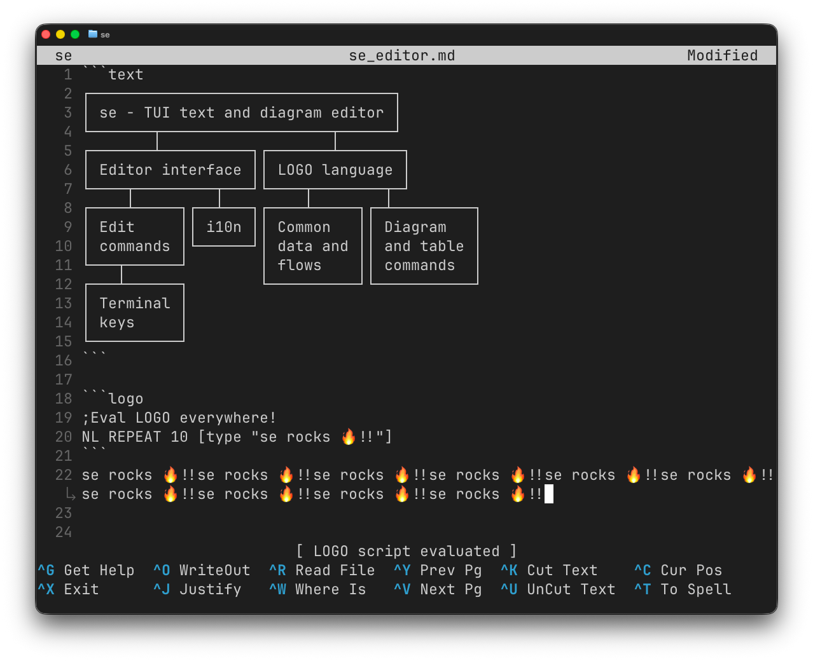

# `zago`

`zago` (zonble's nano + LOGO) is a lightweight terminal text editor with powerful plain-text diagramming.



It keeps Pico/Nano-style editing simple, but adds first-class commands for boxes, connector lines, fills, tables, and repeatable layout work. Press `Esc`, type a command, and shape structured text directly in the buffer.

Create diagrams without leaving your Markdown, notes, or terminal workflow.

## Features

- Plain-text diagramming: draw boxes, arrow connector lines, fills, and table layouts directly in the buffer.
- Natural command prompt: press `Esc` and run editing commands such as `BOX 30 4`, `LINE`, `FILL "hi`, or `REPEAT 5 [...]`.
- Lightweight automation: reuse command sequences with variables, loops, and procedures when editing becomes repetitive.
- Nano/Pico-like modeless editing: `^O` save, `^X` exit, `^W` search, `^K` cut, `^U` paste, `^J` justify, `^Z` undo, `^G` help.
- Unicode-aware layout: CJK and emoji keep boxes, tables, fills, and connector lines aligned.
- Dynamic softwrap, visual paragraph reflow, syntax highlighting, and Nano `.nanorc` syntax loading.
- Multi-buffer editing, file auto-reload, English and Traditional Chinese UI.

## Requirements

- macOS 14.0+ or Linux
- Swift 6.0+
- VT100 / ANSI-compatible terminal

## Quick Start

Install with [Mint](https://github.com/yonaskolb/Mint):

```bash
mint install zonble/zago
zago notes.txt
```

Or run without installing:

```bash
mint run zonble/zago notes.txt
```

Build from source:

```bash
git clone https://github.com/zonble/zago.git
cd zago
swift build -c release
.build/release/zago notes.txt
.build/release/zago notes.txt --wrap 80
.build/release/zago notes.txt --ruler
.build/release/zago --init        # optional: create a starter ~/.zagorc
```

## Command Examples

The command language is LOGO-like because LOGO has a useful property: it often does not feel like programming. Commands read like direct editing actions, but they can still be combined with variables, loops, and procedures when the work becomes repetitive.

```logo
MOVE HOME
TYPE "# "
MOVE END
```

The same language is available from the command prompt, key bindings, and startup configuration. Each editor instance owns one persistent LOGO runtime, so variables and procedures can live for the lifetime of the buffer session.

Create a numbered list:

```logo
MAKE "i" 1 REPEAT 5 [ TYPE :i TYPE ". List item" MOVE DOWN MOVE HOME MAKE "i" (:i + 1) ]
```

Define and reuse an editor-local procedure:

```logo
TO TITLE :text
  BOX :text CENTER ROUND
END

TITLE "Release Notes"
```

Draw and fill a canvas box:

```logo
DRAWBOX 30 4 ROUND
GOTO 2 2
FILL "hi
```

```text
╭────────────────────────────╮
│hihihihihihihihihihihihihihi│
│hihihihihihihihihihihihihihi│
╰────────────────────────────╯
```

Draw a small plain-text architecture diagram:

```logo
DRAWBOX 18 3 "client" CENTER
GOTO 3 11
VLINE 3
GOTO 5 1
DRAWBOX 18 5
GOTO 6 2
TYPE "     server     "
GOTO 7 1
LINE 18
GOTO 8 2
TYPE "    database    "
```

```text
┌────────────────┐
│     client     │
└─────────┬──────┘
          │
┌─────────┴──────┐
│     server     │
├────────────────┤
│    database    │
└────────────────┘
```

## Documentation

- [Editor basics](docs/editor.md)
- [LOGO command language](docs/logo.md)
- [Configuration and key bindings](docs/configuration.md)
- [Pen mode and turtle drawing](docs/logo_pen_mode.md)

## Tests

Run `swift test`.

## License

MIT License. Copyright (c) 2026 Weizhong Yang a.k.a. zonble.
