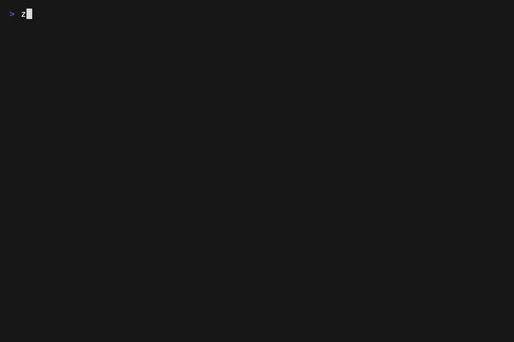

# `zago`: A Lean Terminal Forge for Markdown Writers


In the AI-agent era, Markdown is becoming the control surface for software
work: instructions, specs, review notes, implementation plans, and context that
guide agent CLIs.

But Markdown editing still breaks the terminal flow. GUI editors pull you out
of the shell. Terminal editors usually lack table and diagram tools. A quick
plain-text diagram often means opening a browser-based ASCII diagrammer or a
dedicated diagram drawing app.

`zago` is built for that shift: a lean terminal Markdown forge that keeps prose
editing, pipe tables, local document links, headings, text diagrams, CJK-aware
text tools, and small automation macros in the same plain-text flow, whether
the file is on your laptop or on a server over SSH.

## Who is zago for?

- **AI-agent users** who write Markdown instructions, specs, notes, and review
  context from the terminal.
- **Markdown writers** who want prose, headings, links, tables, and diagrams in
  one terminal tool.
- **Technical writers** who prefer plain-text documents that remain readable in
  Git diffs, SSH sessions, pull requests, and README files.
- **People drawing text diagrams** who do not want to leave the document just to
  open a diagramming app.
- **CJK and emoji perfectionists** who need terminal display width to be correct
  when boxes, status-icon tables, rulers, and wrapped prose are involved.
- **Keyboard-first document builders** who like nano-style editing, but want a
  sharper toolbox for Markdown-era writing.



- [`zago`: A Lean Terminal Forge for Markdown Writers](#zago-a-lean-terminal-forge-for-markdown-writers)
  - [Who is zago for?](#who-is-zago-for)
  - [Features](#features)
  - [Requirements](#requirements)
  - [Quick Start](#quick-start)
  - [Preview Builds](#preview-builds)
  - [Text Mode \& 2D Canvas Mode](#text-mode--2d-canvas-mode)
  - [Text Processing](#text-processing)
  - [Command Examples](#command-examples)
  - [CLI Usage \& Headless Scripting](#cli-usage--headless-scripting)
    - [1. Interactive Editor Mode](#1-interactive-editor-mode)
    - [2. Headless Scripting Mode](#2-headless-scripting-mode)
    - [Command-Line Options](#command-line-options)
  - [FAQ, Sort Of](#faq-sort-of)
  - [Documentation](#documentation)
  - [Tests](#tests)
  - [License](#license)


## Features

- Markdown-first editing: write prose, jump through local document links,
  navigate headings, and keep README-style documents close to their final form.
- Table-aware editing: format Markdown pipe tables, move between table cells,
  and edit table content without breaking borders.
- Plain-text diagramming: draw boxes, arrow connector lines, fills, and table
  layouts directly in the buffer.
- Text processing for writers: count chars, words, lines, CJK chars, and
  emojis; normalize CJK/ASCII spacing; transform selected text between scripts.
- Unicode-aware layout: CJK and emoji such as ✅, ❌, and ⚠️ keep boxes,
  tables, fills, rulers, and connector lines aligned.
- Modeless typing & dual spatial modes: Ordinary typing always inserts text
  directly. Press `M+V` to toggle between standard text stream mode and 2D
  Canvas Mode for freeform grid navigation and block editing.
- Nano-compatible controls: `^O` save, `^X` exit, `^W` search, `M+W` copy, `^K` cut, `^U` paste, `^J` justify, `^Z` undo.
- Dynamic softwrap, visual paragraph reflow, syntax highlighting, and Nano `.nanorc` syntax loading.
- Multi-buffer editing, file auto-reload.
- Natural command prompt: press `Esc` and run editing commands such as `BOX 30 4`, `LINE`, `FILL "hi`, or `REPEAT 5 [...]`.
- Lightweight automation: reuse command sequences with variables, loops, and procedures when editing becomes repetitive.

## Requirements

- macOS 14.0+ or Linux
- Swift 6.0+
- VT100 / ANSI-compatible terminal

## Quick Start

Install from the Homebrew tap:

```bash
brew tap zonble/zago
brew tap --trust zonble/zago  # allow this third-party tap
brew install zago
zago notes.txt
```

If Homebrew refuses to install from an untrusted third-party tap, run the `brew tap --trust zonble/zago` line and install again.

On Linux, the Homebrew formula builds zago with Homebrew's `swift` package. Without Homebrew, install Swift 6 from your distribution or Swift.org and use the source build commands below.

Install with [Mint](https://github.com/yonaskolb/Mint):

```bash
mint install zonble/zago
zago notes.txt
```

Or run without installing:

```bash
mint run zonble/zago notes.txt
```

Build from source:

```bash
git clone https://github.com/zonble/zago.git
cd zago
swift build -c release
.build/release/zago notes.txt
.build/release/zago notes.txt --wrap 80
.build/release/zago notes.txt --ruler
.build/release/zago --init        # optional: create a starter ~/.zagorc
```

## Preview Builds

For early testers, the simplest source install path is:

```bash
git clone https://github.com/zonble/zago.git
cd zago
./build.sh
zago --version
```

This installs `zago` to `/usr/local/bin/zago` by default. To install under your home directory:

```bash
PREFIX="$HOME/.local" ./build.sh
export PATH="$HOME/.local/bin:$PATH"
```

See [Release & Preview Builds](docs/release.md) for smoke tests, known limitations, and what to include in bug reports.

## Text Mode & 2D Canvas Mode

`zago` provides two complementary spatial editing modes. In both modes, typing remains modeless and inserts characters directly:

- **Text Mode** (Default): Standard linear text editing for prose and code. Selections follow linear text streams.
- **Canvas Mode** (`M+V`): Unlocks 2D virtual space navigation beyond line ends. Supports 2D rectangular block selection (`Shift+Arrows`), block copy (`M+W`), block cut (`^K`), and block paste (`^U`) without distorting surrounding text layout.

For details on selection rules and clipboard separation, see [Mark, selection, and canvas behavior](docs/mark.md).

## Text Processing

`zago` is still a text editor. The diagram tools sit on top of ordinary prose editing rather than replacing it:

- Linear text selection in Text Mode and Table Mode, including `Shift+Arrow` and `Shift+Home` / `Shift+End`, with selected text replaced by typing.
- Paragraph justification (`^J`) for mixed CJK and Latin prose, using display width instead of byte or scalar counts.
- Selection-based text transforms from the Tools menu: Traditional/Simplified Chinese conversion, Latin/Hiragana/Katakana/Romaji transliteration, and CJK/ASCII spacing normalization.
- Text counts from the Tools menu. With a selection, `Word Count` reports that selection; without a selection, it reports the whole document. The status includes chars, words, lines, and only shows CJK chars or emojis when present.
- Optional sub line numbers for fixed-width prose drafting: when a wrap column is set, long physical lines can show visual-row numbers and paragraph character counts.
- Document link navigation with `M+O` for local Markdown, Org, reStructuredText, and AsciiDoc links.
- Heading navigation and outline picker for Markdown, Org, reStructuredText, and AsciiDoc documents.

## Command Examples

The command language is Editor LOGO. Commands read like direct editing actions, but they can still be combined with variables, loops, and procedures when the work becomes repetitive.

```logo
BOX 30 5
```

```logo
MOVE HOME
TYPE "# "
MOVE END
```

The same language is available from the command prompt, key bindings, and startup configuration. Variables and procedures stay available throughout your editing session, so they can live for the lifetime of the buffer session.

Create a numbered list:

```logo
REPEAT 5 [ TYPE :# ". List item" NL]
```

or

```logo
FOREACH (ISEQ 1 5) [TYPE ? ". List item" NL]
```

or

```logo
MAKE "i" 1 REPEAT 5 [ TYPE :i TYPE ". List item" MOVE DOWN MOVE HOME MAKE "i" (:i + 1) ]
```

Define and reuse an editor-local procedure:

```logo
TO TITLE :text
  BOX :text CENTER ROUND
END

TITLE "Release Notes"
```

Draw and fill a canvas box:

```logo
DRAWBOX 30 4 ROUND
GOTO 2 2
FILL "hi
```

```text
╭────────────────────────────╮
│hihihihihihihihihihihihihihi│
│hihihihihihihihihihihihihihi│
╰────────────────────────────╯
```

Draw a small plain-text architecture diagram:

```logo
DRAWBOX 18 3 "client" CENTER
GOTO 3 11
VLINE 3
GOTO 5 1
DRAWBOX 18 5
GOTO 6 2
TYPE "     server     "
GOTO 7 1
LINE 18
GOTO 8 2
TYPE "    database    "
```

```text
┌────────────────┐
│     client     │
└─────────┬──────┘
          │
┌─────────┴──────┐
│     server     │
├────────────────┤
│    database    │
└────────────────┘
```

## CLI Usage & Headless Scripting

`zago` operates both as an interactive TUI editor and as a headless CLI diagram/table generator.

### 1. Interactive Editor Mode

Open one or more files in the terminal TUI editor:

```bash
zago notes.txt
zago file1.txt file2.txt --wrap 80 --ruler
```

### 2. Headless Scripting Mode

Execute LOGO scripts or inline LOGO code from the command line, render the canvas to a text buffer, and print the resulting ASCII output directly to stdout:

```bash
# Execute inline LOGO code and print output
zago -e "BOX 20 4; MOVE DOWN MOVE RIGHT; FILL \"Hello World\""

# Execute a LOGO script file and redirect output to a file
zago -s myscript.logo > diagram.txt

# Pipe generated diagram directly to clipboard
zago --run generate_architecture.logo | pbcopy
```

### Command-Line Options

| Option | Flag | Description |
| :--- | :--- | :--- |
| `files` | | File(s) to open in interactive editor mode. |
| `-w`, `--wrap <col>` | | Specify softwrap column width (e.g. 80). |
| `-r`, `--ruler` | | Display WordStar-style ruler bar above viewport. |
| `-e`, `--eval <code>` | | Execute inline LOGO code in headless mode and print to stdout. |
| `-s`, `--run`, `--script <file>` | | Execute a LOGO script file in headless mode and print to stdout. |
| `--init` | | Generate default `~/.zagorc` configuration file. |
| `--syntax <true/false>` | | Enable or disable syntax highlighting. |
| `--lang <en/zh_TW>` | | Set interface language. |

## FAQ, Sort Of

### How do I preview rendered HTML?

You probably don't.

In agent-facing Markdown, the source is the interface. AI agents read the
Markdown itself; they do not need a rendered HTML preview. `zago` focuses on
making that source easier to write, shape, and maintain.

### Why a TUI app when Electron apps exist?

For the same reason AI agent CLIs exist: the terminal is still the shortest path
between code, files, tools, and remote machines.

### Why not Vim or Emacs?

The features I want are not just Markdown syntax helpers. They touch the
editor's interaction model: Text Mode and Canvas Mode, table-cell editing,
rectangular canvas blocks, LOGO commands, selection-based text tools, status
lines, menus, and key bindings.

In a powerful plugin ecosystem, that kind of opinionated workflow can easily
fight the host editor, existing user habits, and other plugins. `zago` keeps the
surface smaller so these pieces can be designed as one coherent Markdown writing
flow.

### Why not Rust?

因為我不會。

### Isn't LOGO for 80s kids?

Yes. BTW, I am an 80s kid. :p

Also, LOGO is still a pretty good little language for movement, repetition,
shapes, and text macros.

### How do I erase a wrong line or box in Canvas Mode?

Type spaces over it, or use Canvas Mode block cut when the shape is rectangular.

## Documentation

- [Editor basics](docs/editor.md)
- [Search behavior](docs/search.md)
- [Mark, selection, and canvas behavior](docs/mark.md)
- [Editor LOGO command language](docs/logo.md)
- [Configuration and key bindings](docs/configuration.md)
- [Pen mode and turtle drawing](docs/logo_pen_mode.md)
- [Diagram snippets & menu rules](docs/diagram_snippets.md)
- [Homebrew tap](docs/homebrew_tap.md)
- [Release & preview builds](docs/release.md)
- [Changelog](CHANGELOG.md)

## Tests

Run `swift test`.

## License

MIT License. Copyright (c) 2026 Weizhong Yang a.k.a. zonble.

*Note: The name `zago` stands for "zonble's nano + LOGO".*
