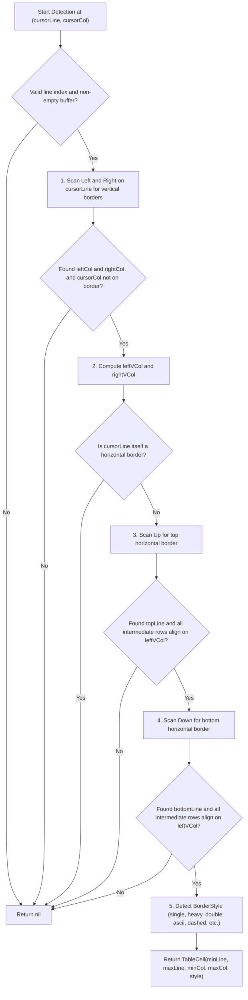

# Table Cell Detector (`TableCellDetector`)

`TableCellDetector` is the core layout scanning algorithm in `zago` responsible for automatically recognizing and locating rectangular table cell and text box boundaries in the text buffer.

When a user presses `F7` or `Alt+T` to enter **Table Mode**, the editor invokes `TableCellDetector` to scan in four directions from the current cursor position and resolve the enclosing cell boundary (`TableCell`).

---

## 📐 Core Concept: Logical Columns vs. Visual Columns

In plain-text ASCII/Unicode art and terminal layout systems, monospace terminal grids align by **Visual Columns (Terminal Display Width)** rather than raw character counts:

* **Half-width / ASCII / Border Glyphs** (e.g., `a`, `1`, `│`, `─`): 1 Character index, occupying **1 visual column**.
* **Full-width / CJK / Emojis** (e.g., `中`, `起`, `✨`): 1 Swift `Character`, but occupying **2 visual columns** in terminal rendering.

### Why Cross-Line Scanning Must Use Visual Columns

When different lines in a buffer contain differing counts of full-width characters (for instance, a diagram with adjacent Chinese-labeled boxes), character offsets (logical columns) and terminal columns (visual columns) diverge.

```text
Row 0: ┌────────┐          ┌────────┐ (Visual: 20~29, Logic: 20~29)
Row 1: │        │          │        │ (Visual: 20~29, Logic: 20~29)
Row 2: │  起點  x          │  終點  │ (Visual: 20~29, Logic: 18~25)
Row 3: │        │          │        │ (Visual: 20~29, Logic: 20~29)
Row 4: └────────┘          └────────┘ (Visual: 20~29, Logic: 20~29)
```

In Row 2 above:
* The left box contains `起點` (taking 4 visual columns with only 2 Swift `Character`s).
* The left vertical border `│` of the right box is visually aligned at **Visual Column 20**.
* However, in the Row 2 character array, its logical character index is **`18`**.

If the detector uses logical columns to scan across lines, checking `chars[20]` on Row 2 inspects a whitespace character instead of `│`, erroneously concluding that the vertical border is broken and truncating or failing cell detection.

Using `TextMetrics`'s `visualColumn(forCharacterOffset:)` and `characterOffset(forVisualColumn:)` ensures that vertical and horizontal borders align correctly regardless of wide CJK/Emoji content.

---

## 🔍 Detection Algorithm Workflow

`detectCell(in lines: [String], line cursorLine: Int, col cursorCol: Int) -> TableCell?`



### 1. Horizontal Boundary Scan (Scan Left & Right)
On the `cursorLine`:
* Scan leftwards for the nearest vertical boundary character (`BorderCharacterSet.verticalBoundaryChars`), yielding `leftCol`.
* Scan rightwards for the nearest vertical boundary character, yielding `rightCol`.
* Reject if cursor is resting directly on the border frame (`cursorCol == leftCol || cursorCol == rightCol`).

### 2. Visual Column Calculation
Convert character offsets of the row boundaries to terminal visual columns:
```swift
let leftVCol = currentLine.visualColumn(forCharacterOffset: leftCol)
let rightVCol = currentLine.visualColumn(forCharacterOffset: rightCol)
```

### 3. Vertical Upward Scan (Scan Up)
Iterate upwards from `cursorLine - 1`:
* If the line segment across `[leftVCol, rightVCol]` is a horizontal border (`isHorizontalBorderLine`), record `topLine` and finish the upward scan.
* If it is a Markdown table header separator (`| Header |`), handle Markdown table header semantics.
* If the line does **not** have a vertical border character aligned at `leftVCol` (`!hasVerticalBorder(lStr, vCol: leftVCol)`), the cell boundary is broken; stop scanning.

### 4. Vertical Downward Scan (Scan Down)
Iterate downwards from `cursorLine + 1`:
* If the line segment across `[leftVCol, rightVCol]` is a horizontal border, record `bottomLine` and finish the downward scan.
* If the line does **not** have a vertical border character aligned at `leftVCol`, stop scanning.

### 5. Style Detection
Inspect corner and junction glyphs on `topLine` at `leftVCol` to determine the active `BorderStyle`:
* **Single Unicode**: `┌─│`
* **Heavy Unicode**: `┏━┃`
* **Double Unicode**: `╔═║`
* **ASCII**: `+-|`
* **Dashed / Double Dash / Triple Dash / Quadruple Dash**: `┌╌╎`, `┌┄┆`, `┌┈┊`, etc.

---

## 📦 Data Structure (`TableCell`)

```swift
public struct TableCell: Equatable, Codable, Sendable {
    public let minLine: Int   // Top border row index
    public let maxLine: Int   // Bottom border row index
    public let minCol: Int    // Left border visual column index
    public let maxCol: Int    // Right border visual column index
    public let style: BorderStyle

    /// Editable inner text bounds (excluding borders)
    public var innerMinLine: Int { minLine + 1 }
    public var innerMaxLine: Int { maxLine - 1 }
    public var innerMinCol: Int { minCol + 1 }
    public var innerMaxCol: Int { maxCol - 1 }
}
```

---

## 🧪 Test Coverage

Key tests verifying cell detection and CJK alignment:
* [`Tests/TableCellDetectorTests.swift`](file:///Users/zonble/Work/zago/Tests/TableCellDetectorTests.swift)
  * `testTableCellDetectorSingleUnicode`: Standard single and multi-cell grid detection.
  * `testTableCellDetectorWithCJKInDiagram`: Detection with CJK wide characters in adjacent shapes.
  * `testTableCellDetectorRecognizesHeavyStyle`: Heavy border style detection.
  * `testTableCellDetectorMarkdownTable`: Markdown pipe table support.
  * `testTableCellDetectorRejectsCursorOnFrame`: Rejection when cursor is on the border.
* [`Tests/TableModeTests.swift`](file:///Users/zonble/Work/zago/Tests/TableModeTests.swift)
  * `testTableModeToggleWithCJKInDiagram`: End-to-end `F7` Table Mode toggle and editing with CJK characters.
