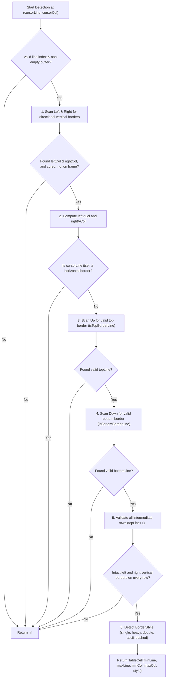

# Table Cell Detector (`TableCellDetector`)

`TableCellDetector` is the core layout scanning algorithm in `zago` responsible for automatically recognizing, validating, and locating rectangular table cell and text box boundaries in the text buffer.

When a user presses <kbd>F7</kbd> or <kbd>Alt</kbd>+<kbd>T</kbd> to enter **Table Mode**, the editor invokes `TableCellDetector` to scan in four directions from the current cursor position and resolve the enclosing cell boundary (`TableCell`).

---

## 📐 Core Concept: Logical Columns vs. Visual Columns

In plain-text ASCII/Unicode art and terminal layout systems, monospace terminal grids align by **Visual Columns (Terminal Display Width)** rather than raw character counts:

* **Half-width / ASCII / Border Glyphs** (e.g., `a`, `1`, `│`, `─`): 1 Character index, occupying **1 visual column**.
* **Full-width / CJK / Emojis** (e.g., `中`, `起`, `✨`): 1 Swift `Character`, but occupying **2 visual columns** in terminal rendering.

### Why Cross-Line Scanning Must Use Visual Columns

When different lines in a buffer contain differing counts of full-width characters (for instance, a diagram with adjacent Chinese-labeled boxes), character offsets (logical columns) and terminal columns (visual columns) diverge:

```text
Row 0: ┌────────┐          ┌────────┐ (Visual: 20~29, Logic: 20~29)
Row 1: │        │          │        │ (Visual: 20~29, Logic: 20~29)
Row 2: │  起點  x          │  終點  │ (Visual: 20~29, Logic: 18~25)
Row 3: │        │          │        │ (Visual: 20~29, Logic: 20~29)
Row 4: └────────┘          └────────┘ (Visual: 20~29, Logic: 20~29)
```

In Row 2 above:
* The left box contains `起點` (taking 4 visual columns with only 2 Swift `Character`s).
* The left vertical border `│` of the right box is visually aligned at **Visual Column 20**.
* However, in the Row 2 character array, its logical character index is **`18`**.

If the detector uses logical columns to scan across lines, checking `chars[20]` on Row 2 inspects a whitespace character instead of `│`, erroneously concluding that the vertical border is broken and truncating or failing cell detection.

Using `TextMetrics`'s `visualColumn(forCharacterOffset:)` and `characterOffset(forVisualColumn:)` ensures that vertical and horizontal borders align correctly regardless of wide CJK/Emoji content.

---

## 🧭 Topological Boundary Directionality

A critical requirement in ASCII/Unicode box detection is **corner and junction directionality**. Characters are not generic boundaries; they have distinct opening and closing orientations:

```text
Left Border  (Opens right / Vertical) : │, ┃, ║, |, ┌, ┏, ╔, ╭, └, ┗, ╚, ╰, ├, ┣, ╠, ┬, ┴, ┼, +
Right Border (Opens left / Vertical)  : │, ┃, ║, |, ┐, ┓, ╗, ╮, ┘, ┛, ╝, ╯, ┤, ┫, ╣, ┬, ┴, ┼, +
Top Border   (Opens down / Horizontal): ─, ━, ═, -, ┌, ┏, ╔, ╭, ┐, ┓, ╗, ╮, ┬, ┳, ╦, ├, ┤, ┼, +
Bottom Border(Opens up / Horizontal)  : ─, ━, ═, -, └, ┗, ╚, ╰, ┘, ┛, ╝, ╯, ┴, ┻, ╩, ├, ┤, ┼, +
```

### Corner Exclusion Rules
* **Left Boundary (`leftBoundaryChars`)**: Must NOT contain right-facing corners (`┐`, `┘`, `┓`, `┛`, `╗`, `╝`, `╮`, `╯`). A right corner terminates a box on the left and cannot open a cell to its right.
* **Right Boundary (`rightBoundaryChars`)**: Must NOT contain left-facing corners (`┌`, `└`, `┏`, `┗`, `╔`, `╚`, `╭`, `╰`).
* **Top Boundary (`topBoundaryChars`)**: Must NOT contain upward-only bottom corners or bottom T-junctions (`└`, `┘`, `┴`, `┗`, `┛`, `┻`, `╚`, `╝`, `╩`, `╰`, `╯`).
* **Bottom Boundary (`bottomBoundaryChars`)**: Must NOT contain downward-only top corners or top T-junctions (`┌`, `┐`, `┬`, `┏`, `┓`, `┳`, `╔`, `╗`, `╦`, `╭`, `╮`).

---

## 🔍 Detection Algorithm Workflow

`detectCell(in lines: [String], line cursorLine: Int, col cursorCol: Int) -> TableCell?`



### 1. Directional Boundary Scan (Scan Left & Right)
On the `cursorLine`:
* Scan leftwards for a character in `BorderCharacterSet.leftBoundaryChars`, yielding `leftCol`.
* Scan rightwards for a character in `BorderCharacterSet.rightBoundaryChars`, yielding `rightCol`.
* Reject if the cursor is resting directly on the border frame (`cursorCol == leftCol || cursorCol == rightCol`).

### 2. Visual Column Calculation
Convert character offsets of the row boundaries to terminal visual columns:
```swift
let leftVCol = currentLine.visualColumn(forCharacterOffset: leftCol)
let rightVCol = currentLine.visualColumn(forCharacterOffset: rightCol)
```

### 3. Continuous Horizontal Border Validation
A valid horizontal border between `leftVCol` and `rightVCol` must be **strictly continuous**:
* Must NOT contain any whitespace characters (` `). A space gap indicates separate adjacent shapes rather than a single spanning border.
* Every character across `(leftCharIdx + 1)...(rightCharIdx - 1)` must belong to `BorderCharacterSet.horizontalBoundaryChars` (or `:` for Markdown tables).

### 4. Vertical Upward Scan (Scan Up)
Iterate upwards from `cursorLine - 1`:
* If the line across `[leftVCol, rightVCol]` satisfies `isTopBorderLine`, record `minLine = lUp` and terminate the upward search.
* If it is a Markdown table header separator (`| Header |`), handle Markdown table header semantics.
* If intermediate rows lack valid left or right vertical boundaries (`!hasLeftVerticalBorder` or `!hasRightVerticalBorder`), terminate the upward search (leaving `minLine = nil` if no top border was reached).

### 5. Vertical Downward Scan (Scan Down)
Iterate downwards from `cursorLine + 1`:
* If the line across `[leftVCol, rightVCol]` satisfies `isBottomBorderLine`, record `maxLine = lDown` and terminate the downward search.
* If intermediate rows lack valid left or right vertical boundaries, stop scanning downwards. **Broken intermediate rows are never substituted as bottom borders.**
* **Markdown Exception**: In Markdown pipe tables without bottom border lines, allow `maxLine` to resolve to the end of consecutive pipe rows.

### 6. Intermediate Row Verification
Verify that every row `l` in `(topLine + 1)..<bottomLine` contains intact, unbroken left and right vertical boundaries (`hasLeftVerticalBorder` and `hasRightVerticalBorder`).

### 7. Style Detection
Inspect corner and junction glyphs on `topLine` at `leftVCol` to determine the active `BorderStyle`:
* **Single Unicode**: `┌─│`
* **Heavy Unicode**: `┏━┃`
* **Double Unicode**: `╔═║`
* **ASCII**: `+-|`
* **Dashed / Double Dash / Triple Dash / Quadruple Dash**: `┌╌╎`, `┌┄┆`, `┌┈┊`, etc.

---

## 📦 Data Structure (`TableCell`)

```swift
public struct TableCell: Equatable, Codable, Sendable {
    public let minLine: Int   // Top border row index
    public let maxLine: Int   // Bottom border row index
    public let minCol: Int    // Left border visual column index
    public let maxCol: Int    // Right border visual column index
    public let style: BorderStyle

    /// Editable inner text bounds (excluding borders)
    public var innerMinLine: Int { minLine + 1 }
    public var innerMaxLine: Int { maxLine - 1 }
    public var innerMinCol: Int { minCol + 1 }
    public var innerMaxCol: Int { maxCol - 1 }

    public func contains(line: Int, col: Int) -> Bool {
        return line >= innerMinLine && line <= innerMaxLine && col >= innerMinCol && col <= innerMaxCol
    }
}
```

---

## 🧪 Test Coverage & Invariant Matrix

The test suite in [`Tests/TableCellDetectorTests.swift`](file:///Users/zonble/Work/zago/Tests/TableCellDetectorTests.swift) and [`Tests/TableModeTests.swift`](file:///Users/zonble/Work/zago/Tests/TableModeTests.swift) continuously asserts the following topological invariants:

| Scenario | Tested Invariant | Assertion |
| :--- | :--- | :--- |
| **Single Box & Grids** | Standard Unicode, Heavy, Double, ASCII, Dashed styles | Resolves correct `TableCell` bounds and style |
| **Adjacent Boxes with Gap** | Cursor placed in whitespace gap between separate boxes (`z`) | Returns `nil` (rejects entering Table Mode) |
| **Connected Boxes** | Horizontal connector lines (`├────────┤`) linking boxes with CJK text | Resolves enclosing box without fusing across the connector |
| **Broken Box Side Frame** | Missing vertical border glyph replaced by non-border character (`x`) | Returns `nil` when cursor is on the broken row |
| **Broken Box Upper Row** | Cursor in valid row (`a`) above a broken lower row (`x`) | Returns `nil` (rejects broken box, never treats `x` row as bottom border) |
| **CJK Wide Characters** | Boxes containing 2-column CJK text labels (`起點`, `終點`) | Aligns cross-line visual columns accurately |
| **Frame Cursors** | Cursor resting directly on top, bottom, left, or right frame | Returns `nil` |

Key end-to-end integration tests:
* [`Tests/TableModeTests.swift`](file:///Users/zonble/Work/zago/Tests/TableModeTests.swift)
  * `testTableModeToggleWithCJKInDiagram`: End-to-end `F7` Table Mode toggle and editing with CJK characters.
  * `testTableModeRejectsF7InGapBetweenBoxes`: Asserts rejection in whitespace gaps between boxes.
  * `testTableModeRejectsF7OnBrokenBoxWithX`: Asserts rejection inside broken boxes.

