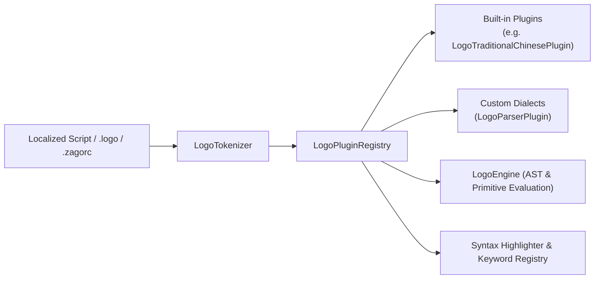

# Editor LOGO Dialect Extension & User Guide

`zago` features an extensible **Dialect & Localization Plugin System** for Editor LOGO. This system allows the language to be programmed using natural, localized keywords (e.g. Traditional Chinese, Japanese, French) while maintaining 100% semantic compatibility with standard LOGO primitives and engine evaluation.

---

## 🎯 Architecture Overview

The dialect architecture separates tokenizer parsing from execution:



---

## 👤 User Guide: Loading Dialects in `.zagorc`

### 1. Configuration Directives

Users can load dialects in `~/.zagorc` (or workspace `.zagorc` / legacy `.serc`) using the `load dialect` or `load` directive:

```ini
# Load the Traditional Chinese dialect
load dialect zh-TW

# Or shorthand
load zh-TW
```

### 2. Automatic Language Detection

If the editor UI language is set to Traditional Chinese (`set lang zh_TW` or detected from system locale), `zago` automatically activates the `zh-TW` dialect on startup.

### 3. Writing Localized LOGO Scripts

Once a dialect is loaded, all localized keywords, primitives, operators, headings, and filler tokens work seamlessly:

```logo
; 繁體中文方言繪圖範例
自訂 "繪製卡片 [ [ 標題 內容 ] [
    畫框 :標題 24 6 居中 雙線 圓角
    換行 填入 :內容
] ]

繪製卡片 "系統架構 "核心模組運作正常
```

### 4. Syntax Highlighting & Auto-Completion

The editor's built-in syntax highlighter automatically registers all keywords and aliases from active dialects, providing syntax coloring and context awareness for localized tokens.

---

## 💻 Developer Guide: Creating & Extending Dialects

To add a new language dialect or domain-specific vocabulary to `zago`, implement the `LogoParserPlugin` protocol.

### 1. The `LogoParserPlugin` Protocol

Defined in [`Sources/LogoEngine/Plugins/LogoParserPlugin.swift`](file:///Users/zonble/Work/zago/Sources/LogoEngine/Plugins/LogoParserPlugin.swift):

```swift
public protocol LogoParserPlugin: Sendable {
    /// Primary identifier for this dialect (e.g. "ja", "fr", "zh-TW").
    var id: String { get }

    /// Human-readable display name (e.g. "Japanese (日本語)").
    var displayName: String { get }

    /// Alternative identifiers or aliases (e.g. ["ja-JP", "japanese"]).
    var aliases: [String] { get }

    /// Parses localized primitive tokens (e.g. "畫框" -> .drawBox).
    func parsePrimitive(_ token: String) -> LogoPrimitive?

    /// Parses localized operators (e.g. "大於" -> .greaterThan).
    func parseOperator(_ token: String) -> LogoOperator?

    /// Parses localized headings (e.g. "北" -> .up, "東" -> .right).
    func parseHeading(_ token: String) -> LogoHeading?

    /// Parses boolean literals (e.g. "真" -> true, "假" -> false).
    func parseBoolean(_ token: String) -> Bool?

    /// Parses exit positions (e.g. "東北" -> .ne).
    func parseExitPosition(_ token: String) -> BoxExitPosition?

    /// Parses border styles (e.g. "雙線" -> .double, "三段虛線" -> .tripleDash).
    func parseBorderStyle(_ token: String) -> BorderStyle?

    /// Parses calendar identifiers (e.g. "和曆" -> .japanese, "民國曆" -> .republicOfChina).
    func parseCalendarIdentifier(_ token: String) -> Calendar.Identifier?

    /// Parses date/time formatting presets (e.g. "詳細" -> .long, "完整" -> .full).
    func parseDateTimeStylePreset(_ token: String) -> LogoDateTimeStylePreset?

    /// Parses number formatting styles (e.g. "金融" -> .financial, "中文數字" -> .spellout).
    func parseNumberStyle(_ token: String) -> LogoNumberStyle?

    /// Parses list conjunction types (e.g. "且" -> .and, "或" -> .or).
    func parseListType(_ token: String) -> LogoListType?

    /// Parses byte count styles (e.g. "檔案大小" -> .file, "記憶體" -> .memory).
    func parseByteCountStyle(_ token: String) -> LogoByteCountStyle?

    /// Parses person name styles (e.g. "簡短" -> .short, "詳細" -> .long).
    func parsePersonNameStyle(_ token: String) -> LogoPersonNameStyle?

    /// Set of grammatical filler / noise tokens to skip during argument parsing.
    var fillerTokens: Set<String> { get }

    /// All keyword aliases provided by this plugin (for syntax highlighting and completion).
    var keywordAliases: [String] { get }

    /// Returns all dialect aliases for the specified primitive.
    func aliases(for primitive: LogoPrimitive) -> [String]
}
```

> [!NOTE]
> `LogoParserPlugin` provides default implementations for all parse methods returning `nil` or `[]`. You only need to override the members relevant to your dialect.

---

### 2. Implementation Example: Creating a Minimal Japanese Plugin

```swift
import Drawing
import Foundation
import LogoEngine

public struct LogoJapanesePlugin: LogoParserPlugin {
    public let id = "ja"
    public let displayName = "Japanese (日本語)"
    public let aliases = ["ja-JP", "japanese"]

    private let primitiveMap: [String: LogoPrimitive] = [
        "前進": .forward,
        "後退": .back,
        "右回転": .right,
        "左回転": .left,
        "枠描画": .drawBox,
        "表描画": .table,
        "線描画": .line,
        "出力": .output,
        "変数": .make,
        "定義": .define,
        "反復": .repeatLoop,
    ]

    public func parsePrimitive(_ token: String) -> LogoPrimitive? {
        primitiveMap[token]
    }

    public func parseBoolean(_ token: String) -> Bool? {
        switch token {
        case "真", "はい": return true
        case "偽", "いいえ": return false
        default: return nil
        }
    }

    public func parseHeading(_ token: String) -> LogoHeading? {
        switch token {
        case "北", "上": return .up
        case "東", "右": return .right
        case "南", "下": return .down
        case "西", "左": return .left
        default: return nil
        }
    }

    public var fillerTokens: Set<String> {
        ["の", "を", "に", "へ", "と"]
    }

    public var keywordAliases: [String] {
        Array(primitiveMap.keys) + ["真", "偽", "北", "東", "南", "西"]
    }

    public func aliases(for primitive: LogoPrimitive) -> [String] {
        primitiveMap.compactMap { $0.value == primitive ? $0.key : nil }
    }
}
```

---

### 3. Registering the Plugin

#### Option A: Register as a Built-in Dialect
Add the plugin instance to `LogoLocalizationRegistry.allDialects` in [`Sources/LogoLocalization/LogoLocalizationRegistry.swift`](file:///Users/zonble/Work/zago/Sources/LogoLocalization/LogoLocalizationRegistry.swift):

```swift
public enum LogoLocalizationRegistry {
    public static let allDialects: [any LogoParserPlugin] = [
        LogoTraditionalChinesePlugin(),
        LogoJapanesePlugin(), // Added
    ]
}
```

#### Option B: Dynamic Registration in `LogoEngine` or `LogoPluginRegistry`
For custom host applications or tests:

```swift
let registry = LogoPluginRegistry()
registry.register(LogoJapanesePlugin())

let engine = LogoEngine(pluginRegistry: registry)
engine.execute("枠描画 \"タイトル 20 4")
```

---

### 4. Handling Grammatical Filler Tokens (Noise Words)

Natural languages often include grammatical particles or prepositions (e.g. Chinese `個`, `項`, `為`; Japanese `の`, `を`).

By adding these tokens to `fillerTokens`:
- The parser automatically skips them when reading arguments for control flows like `CASE` / `COND` or custom procedures.
- Users can write fluid, natural prose without breaking argument binding.

---

## 🧪 Unit Testing Guidelines

When adding or updating a dialect, add unit tests in `Tests/LogoLocalizationTests.swift` following this pattern:

```swift
@Test
func testJapaneseDialectParsing() {
    let plugin = LogoJapanesePlugin()
    
    // 1. Primitive mapping
    #expect(plugin.parsePrimitive("枠描画") == .drawBox)
    #expect(plugin.parsePrimitive("前進") == .forward)

    // 2. Boolean & Heading
    #expect(plugin.parseBoolean("真") == true)
    #expect(plugin.parseHeading("北") == .up)

    // 3. Execution in LogoExecutionService
    let lines = LogoExecutionService.render(
        script: "枠描画 \"テスト 10 3",
        plugins: [plugin]
    )
    #expect(lines.joined().contains("テスト"))
}
```

---

## 📁 Source References

- **Protocol Definition**: [`Sources/LogoEngine/Plugins/LogoParserPlugin.swift`](file:///Users/zonble/Work/zago/Sources/LogoEngine/Plugins/LogoParserPlugin.swift)
- **Plugin Registry**: [`Sources/LogoEngine/Plugins/LogoPluginRegistry.swift`](file:///Users/zonble/Work/zago/Sources/LogoEngine/Plugins/LogoPluginRegistry.swift)
- **Built-in Registry**: [`Sources/LogoLocalization/LogoLocalizationRegistry.swift`](file:///Users/zonble/Work/zago/Sources/LogoLocalization/LogoLocalizationRegistry.swift)
- **Traditional Chinese Plugin**: [`Sources/LogoLocalization/Chinese/LogoTraditionalChinesePlugin.swift`](file:///Users/zonble/Work/zago/Sources/LogoLocalization/Chinese/LogoTraditionalChinesePlugin.swift)
- **Localization Tests**: [`Tests/LogoLocalizationTests.swift`](file:///Users/zonble/Work/zago/Tests/LogoLocalizationTests.swift)
