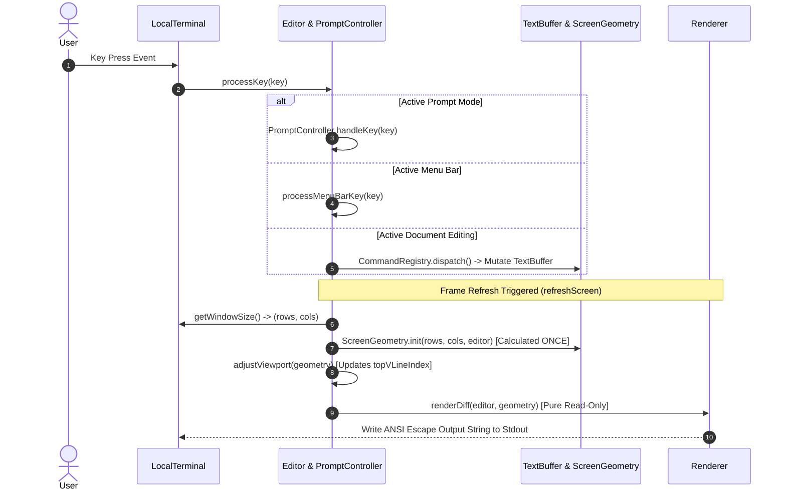

# MVC & Architectural Layering in `zago`

This document details the Model-View-Controller (MVC) architectural design, responsibility boundaries, and per-frame data flow of the `zago` terminal text editor.

---

## 1. Overview & Architectural Mindset

As `zago` grew from a simple terminal editor into a feature-rich terminal IDE supporting multiple editing paradigms (Text mode, Canvas drawing mode, Table structure editing, LOGO macro scripts, and Markdown Outline views), enforcing a strict **MVC & Layered Architecture** became paramount.

The core design goals of `zago`'s architecture are:
1. **Pure Read-Only Renderer (View)**: The rendering pipeline accepts a snapshot of `(Editor, ScreenGeometry)` and produces ANSI SGR escape sequences without mutating any domain model state or viewport offsets.
2. **Single-Pass Frame Geometry**: Window layout calculations (header height, ruler visibility, line numbers gutter width, main text area bounds) are computed exactly **once per render frame** via an immutable `ScreenGeometry` value object.
3. **Decoupled Input & Command Handling (Controller)**: Keyboard events are processed by specialized controllers (`PromptController`, `MenuBar`, and `CommandRegistry`) before mutating the underlying buffer models.
4. **Pure Domain Models (Model)**: `TextBuffer` and `LayoutEngine` operate purely on text arrays, line wrapping math, and selection ranges, remaining completely agnostic of ANSI styling, terminal terminal details, and screen geometry.

---

## 2. Directory & Component Structure

The `Sources/Editor` target is organized into four clean architectural tiers:

```
Sources/Editor/
├── Models/                   # Domain Models & Geometry Math
│   ├── TextBuffer.swift
│   ├── TextBuffer+Selection.swift
│   ├── DirectoryBuffer.swift
│   ├── LayoutEngine.swift
│   ├── ScreenGeometry.swift
│   ├── TableCellDetector.swift
│   ├── DocumentLink.swift
│   ├── EditorOptions.swift
│   ├── EditorConfigSource.swift
│   ├── EditorLimits.swift
│   └── EditorDependencies.swift
│
├── Views/                    # Presentation Layer (100% Pure & Read-Only)
│   ├── Renderer.swift
│   ├── ANSIStyle.swift
│   ├── TextDocumentView.swift
│   ├── Components/
│   │   ├── MenuBar.swift
│   │   ├── Renderer+Overlay.swift
│   │   └── Renderer+StatusAndHelp.swift
│   └── Modals/
│       ├── DocumentOutlineView.swift
│       ├── HelpContent.swift
│       ├── LogoReferenceContent.swift
│       └── LogoWorkspaceContent.swift
│
├── Controllers/              # State Coordinators & Input Controllers
│   ├── Editor.swift
│   ├── DocumentOutlineController.swift
│   ├── MenuBarController.swift
│   ├── PromptController.swift
│   ├── SearchController.swift
│   ├── TableModeController.swift
│   ├── CanvasModeController.swift
│   ├── Editor+Buffer.swift
│   ├── Editor+Commands.swift
│   ├── Editor+DisplayConfig.swift
│   ├── Editor+DomainCommands.swift
│   ├── Editor+Events.swift
│   ├── Editor+Logo.swift
│   ├── Editor+Modes.swift
│   ├── Editor+Prompts.swift
│   ├── Editor+Render.swift
│   ├── Editor+Undo.swift
│   ├── EditorFileIO.swift
│   └── EditorTerminal.swift
│
├── Commands/                 # Command Pattern Definitions
│   ├── Command.swift
│   ├── BufferCommands.swift
│   ├── EditingCommands.swift
│   ├── FileCommands.swift
│   ├── NavigationCommands.swift
│   ├── SearchCommands.swift
│   ├── SelectionCommands.swift
│   ├── SettingCommands.swift
│   ├── TableModeCommands.swift
│   └── UICommands.swift
│
└── Localization/             # Internationalization & String Resources
    ├── Localization.swift
    ├── EnglishStrings.swift
    └── TraditionalChineseStrings.swift
```

---

## 3. Tier Responsibilities

### 3.1 Model Layer (`Sources/Editor/Models/`)
* **`TextBuffer`**: Stores raw document lines (`[String]`), cursor position (`lineIndex`, `columnIndex`), text selection ranges (`selectionMark`), and the undo/redo history stack (`undoStack`).
* **`LayoutEngine`**: Pure mathematical line-wrapping engine. Computes virtual line chunks (`[VirtualLine]`) for soft-wrapped text and performs bidirectional coordinate transformations (`(bufferLine, bufferCol)` $\rightleftharpoons$ `(vLine, vCol)`).
* **`ScreenGeometry`**: Immutable per-frame value object containing calculated terminal dimensions (`rows`, `cols`), UI chrome heights, gutter widths (`gutterWidth`), and effective text area bounds (`mainAreaHeight`, `textWidth`).
* **`EditorOptions` / `EditorConfigSource`**: Value objects for launching editor instances and reading configuration files (`.zagorc`).

### 3.2 View Layer (`Sources/Editor/Views/`)
* **`Renderer`**: Master double-buffering screen line diffing presenter. Compiles full ANSI screen output by assembling component strings.
* **`ANSIStyle`**: Utility providing SGR ANSI escape code constants and chainable `.ansiStyled(style:)` extensions.
* **`Views/Components/`**:
  * `TitleAndMenuBar`: Renders header bar and interactive top menu categories.
  * `Renderer+Overlay`: Renders 2D dropdown menu overlays and box-drawing character borders.
  * `Renderer+StatusAndHelp`: Renders status indicator bar, prompt input line, WordStar ruler, and dynamic contextual help bar.
* **`Views/Modals/`**: Full-screen or floating overlay views (`DocumentOutlineView`, `HelpContent`, `LogoReferenceContent`).

### 3.3 Controller Layer (`Sources/Editor/Controllers/`)
* **`Editor`**: Central application state controller. Owns active buffers, runtime mode switches (`isTableModeActive`, `isCanvasModeActive`), language preferences, and prompt sessions.
* **`PromptController`**: Manages interactive command bar prompts (e.g., Search, Goto Line, Save File Path, Exit Confirmation). Encapsulates prompt input buffer (`inputText`), completion ghosts, and dynamic shortcut definitions (`promptHelpShortcuts(editor:)`).
* **`Editor+Render.swift`**: Coordinates frame refresh lifecycles (`refreshScreen()`, `adjustViewport()`).

---

## 4. Frame Execution Lifecycle & Data Flow

Every frame execution in `zago` follows a strict linear pipeline:



---

## 5. Architectural Benefits

1. **Zero Side-Effects During Rendering**: Because `Renderer` accepts an immutable `ScreenGeometry` and operates 100% read-only, unit tests can invoke rendering functions without accidentally mutating editor scrolling offsets or buffer contents.
2. **High Cohesion & Low Coupling**: `TextBuffer` knows nothing about terminal widths; `Renderer` knows nothing about keyboard dispatching; `PromptController` handles prompts without cluttering `Editor.swift`.
3. **Robust Testability**: Individual UI components, layout mathematical algorithms, and prompt lifecycles can be unit-tested in complete isolation.
