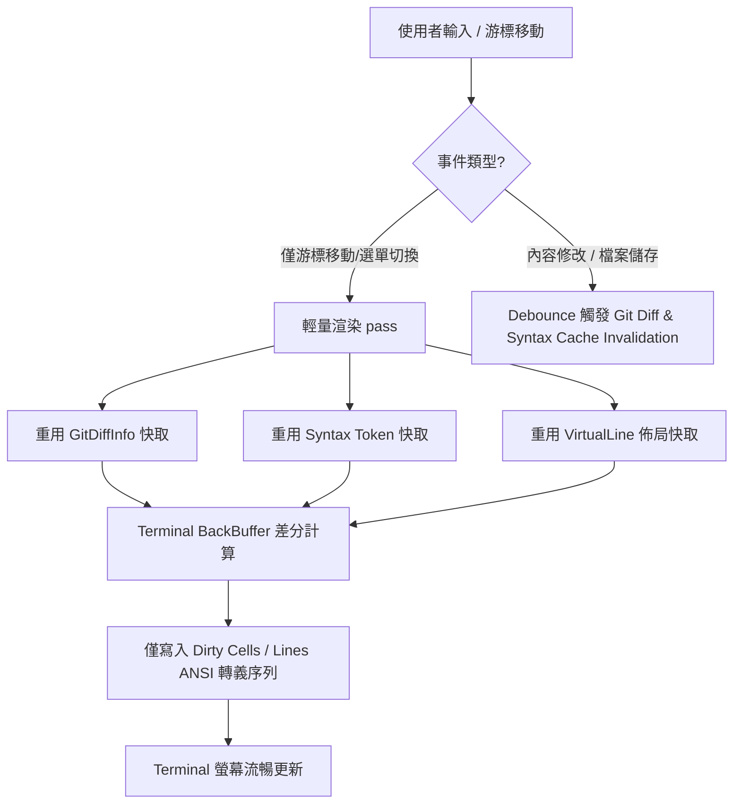

# Buffer 渲染效能改善計畫 (Buffer Rendering Performance Improvement Plan)

## 1. 背景與目標

`zago` 作為一個支援多模式（Text、Canvas、Table Mode）與 rich text/diagram 渲染的文字編輯器，極為依賴流暢的 Terminal 畫面刷新體驗。

目前編輯器在每次按鍵輸入或游標移動時，均會觸發全畫面重繪（Full-Screen Redraw）。隨著檔案尺寸增大或開啟語法高亮/ Git 整合功能時，出現了畫面閃爍（Flickering）與輸入延遲（Input Latency）等效能瓶頸。

本計畫旨在透過架構優化、快取機制與差分渲染，大幅提升 `zago` 的渲染效能與回應速度。

---

## 2. 現狀問題與瓶頸分析

經分析現有 `Renderer.swift` 與 `Editor+Render.swift` 的實作架構，發現以下四大關鍵瓶頸：

### 2.1 每次按鍵同步觸發 Git Diff 運算 (`P0`)
- **現狀**：在 `Renderer.render()` 入口處（`Renderer.swift#L24`），每次畫面刷新（含單純移動游標）都會同步呼叫 `editor.updateGitDiff()`。
- **影響**：觸發磁碟檔名檢查、`.git/HEAD` 讀取與 `GitDiffEngine.computeDiff()` 逐行演算法，在大型儲存庫或頻繁按鍵時造成 UI 主執行緒阻塞。

### 2.2 全畫面 (Full-Screen) ANSI 重新繪製 (`P1`)
- **現狀**：每次 `refreshScreen()` 都會生成從畫面第 1 行到最後一行的完整 ANSI 轉義控制字串（標題列、選單、尺規、文字區、狀態列、說明列），並直接全量寫入 Terminal。
- **影響**：在 Windows Terminal 或遠端 SSH 連線下產生明顯的**畫面閃爍**，並產生大量不必要的字串拼接與 I/O 開銷。

### 2.3 語法高亮 (Syntax Highlighting) 無跨幀快取 (`P1`)
- **現狀**：`renderMainTextArea` 中的 `tokenTypesCache` 僅為該次繪製函數內的區域變數，繪製結束後即被丟棄。
- **影響**：每一幀都需要對 Viewport 可見區域的所有行重新執行語法解析與正則表達式匹配（Regex matching）。在大檔案或 Markdown/Org-mode 嵌入程式碼區塊時負擔沉重。

### 2.4 視覺寬度與軟換行 (Virtual Line / Visual Width) 重複計算 (`P2`)
- **現狀**：每次重繪時，`LayoutEngine` 都會重新對可見行進行 CJK 雙寬度 (`displayWidth`) 走訪與 `VirtualLine` 軟換行切割。
- **影響**：當游標僅在上下左右移動、文字內容未變更時，依然浪費 CPU 時間重複計算不變的文字寬度與換行邊界。

---

## 3. 改善方案細節與技術架構

### Phase 1: Git Diff 事件驅動與 Dirty-Flag 觸發機制 (`P0`)
1. **解耦渲染與 Git 運算**：移除 `Renderer.render()` 中的同步 `editor.updateGitDiff()` 呼叫。
2. **事件驅動更新**：
   - 僅在 **Buffer 內容異動 (`TextBuffer` mutate)**、**檔案儲存 (`Save`)** 或 **自動重新載入** 時將 `gitDiffDirty` 標記為 `true`。
   - 引進 Debounce Timer（預設 300ms），在使用者停止打字後於非同步執行緒（`computeDiffAsync`）更新 `gitDiffInfo`。
3. **預期效果**：游標移動與純選單操作達到 0ms 的 Git 開銷。

### Phase 2: 持久化語法高亮快取 (Syntax Token Caching) (`P1`)
1. **行級快取結構**：在 `SyntaxHighlighter` 中維護 `[BufferLineIndex: [SyntaxTokenType]]` 的持久化快取。
2. **選擇性無效化 (Selective Invalidation)**：
   - 單行修改：僅無效化該行及其後續可能受影響的跨行語法區塊（如未閉合的多行註解或 Markdown 程式碼區塊）。
   - 插入/刪除行：調整快取 Index 映射關係。
3. **預期效果**：語法高亮計算時間降低 80% 以上。

### Phase 3: Terminal 畫面差分渲染 (Double Buffering / Screen Diffing) (`P1`)
1. **雙緩衝架構 (Double Buffering)**：
   - 定義 `TerminalCell` 結構（包含 `char`、`fgColor`、`bgColor`、`attributes`）。
   - 維護 `frontBuffer: [[TerminalCell]]` 與 `backBuffer: [[TerminalCell]]`。
2. **差分輸出 (Screen Diffing)**：
   - `Renderer` 繪製至 `backBuffer`。
   - 比較 `backBuffer` 與 `frontBuffer` 的相異點，僅對發生變動的列或格點發出 ANSI 游標定位（`\u{1B}[y;xh`）與字元印出指令。
3. **預期效果**：消除所有畫面閃爍，Terminal Write I/O 降低 90%。

### Phase 4: Viewport 軟換行與 CJK 寬度佈局快取 (`P2`)
1. **Virtual Line 行級快取**：快取未修改行的 `VirtualLine` 拆分結果與 CJK `displayWidth` 累積陣列。
2. **視圖快速定位**：在純游標移動時，直接透過快取之 `VirtualLine` 轉譯標頭與顯示寬度。

---

## 4. 里程碑與預期收益 (Milestones & Expected Benefits)

| 里程碑 | 改善項目 | 預估工時 | 預期收益 |
| :--- | :--- | :--- | :--- |
| **Milestone 1** | Git Diff 改為事件驅動與 Dirty-Flag 機制 | 0.5 天 | 徹底消除按鍵與游標移動時的同步 Git 阻塞開銷 |
| **Milestone 2** | 行級 Syntax Token 快取與無效化機制 | 1 天 | 大檔案/複雜語法渲染 CPU 佔用降低 70-80% |
| **Milestone 3** | Terminal Double Buffering (畫面差分渲染) | 2 天 | 徹底消除 Terminal 畫面閃爍，I/O 資料量減少 90% |
| **Milestone 4** | Virtual Line / CJK 寬度快取與單元測試 | 1 天 | 提升長文字行與軟換行捲動順暢度 |

---

## 5. 驗證與指標 (Verification & Metrics)

1. **FPS 與輸入延遲**：
   - 輸入延遲從目前的 >30ms 降低至 **<5ms**。
2. **I/O 寫入量**：
   - 游標移動時的 ANSI 控制碼寫入量從每次全畫面（~4KB）降低至單點更新（**<30 Bytes**）。
3. **CPU 使用率**：
   - 在 10,000 行 Markdown 檔案中連續移動游標時，CPU 使用率降低 80% 以上。
